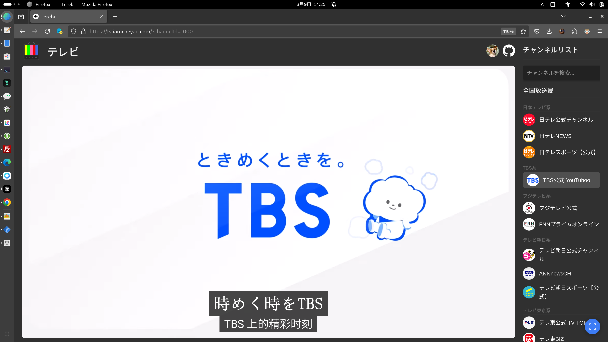

# 

# Terebi プロジェクト

このプロジェクトは、日本のテレビ局のYouTubeチャンネルを管理し、動画をランダムに再生するWebアプリケーションです。

## 機能

- 全国および地方の放送局のYouTubeチャンネルをリスト表示
- キャッシュされたチャンネルのみを表示
- ランダムにチャンネルを選択し、動画を再生
- チャンネルの動画リストをJSONファイルとして保存

## ファイル構成

### 核心文件

#### HTML文件：
- ✅ `index.html` - 主页面
- ✅ `about.html` - 关于页面

#### Python脚本：
- ✅ `app.py` - 主应用
- ✅ `update.py` - 更新脚本
- ✅ `scheduler.py` - 调度器
- ✅ `add_channel.py` - 添加频道
- ✅ `add_channel_interactive.py` - 交互式添加频道
- ✅ `mark_channels.py` - 标记频道
- ✅ `unify_bakname_english.py` - 统一bakname
- ✅ `rss_bulk_fetch.py` - RSS批量获取

#### 数据文件：
- ✅ `all_channels.json` - 合并后的统一频道数据
- ✅ `manifest.json` - 应用清单
- ✅ `fix_cross_origin_error.js` - 跨域错误修复

### 目录结构

- `data/` - 频道数据JSON文件存储目录
- `img/` - 频道头像和缩略图存储目录
- `scripts/` - JavaScript脚本文件
- `tools/` - 工具脚本目录
- `backend/` - 后端服务文件
- `venv/` - Python虚拟环境

## 使用方法

### 基本使用

1. **启动Web服务器**：
   ```bash
   # 使用Python内置服务器
   python -m http.server 8005
   
   # 或使用其他Web服务器
   ```

2. **访问应用**：
   - 打开浏览器访问 `http://localhost:8005`
   - 主页面：`index.html`
   - 关于页面：`about.html`

3. **频道管理**：
   - 使用 `add_channel_interactive.py` 添加新频道
   - 使用 `update.py` 更新频道数据
   - 使用 `mark_channels.py` 标记频道状态

### 数据管理

- **统一数据源**：所有频道数据现在统一存储在 `all_channels.json` 中
- **频道分类**：通过 `type` 字段区分电视台 (`tv`) 和YouTube频道 (`youtube`)
- **URL参数控制**：
  - `?tv=1` - 显示所有频道（电视台 + YouTube）
  - 无参数 - 只显示YouTube频道

## 一発追加（追加→抓取→头像→缩略图）

新脚本 `add_channel_interactive.py` 支持一条命令完成从“添加频道”到“抓取视频列表与头像并生成缩略图”的全流程。

前提：
- `WEB-INF/config.properties` 中已配置至少一个 `youtube.apikeyN=...`
- 推荐使用项目自带 venv 运行（已内置 Pillow）

用法：
```bash
# 交互输入频道URL
/Users/tetsuya/Dev/Terebi/venv/bin/python add_channel_interactive.py

# 单个频道
/Users/tetsuya/Dev/Terebi/venv/bin/python add_channel_interactive.py --url https://www.youtube.com/@shioneru

# 批量添加多个频道（自动确认）
/Users/tetsuya/Dev/Terebi/venv/bin/python add_channel_interactive.py --url @handle1 @handle2 @handle3 --yes

# 可选：自定义显示名称与归类
/Users/tetsuya/Dev/Terebi/venv/bin/python add_channel_interactive.py \
  --url https://www.youtube.com/@mezamashitvchannel \
  --name "めざましテレビチャンネル" \
  --category "その他" \
  --subcategory "その他チャンネル"

# 批量添加到指定分类
/Users/tetsuya/Dev/Terebi/venv/bin/python add_channel_interactive.py \
  --url @handle1 @handle2 @handle3 \
  --category "地方放送局" \
  --subcategory "九州地方" \
  --yes
```

脚本会：
- **智能跳过**：检查频道是否已存在，存在则跳过，避免消耗API
- 覆盖/添加频道到 `all_channels.json`（不设置 skip，`cached:false`）
- 解析频道ID并调用 YouTube Data API 抓取上传列表（默认最多 200 条），生成 `data/{名称}.json`
- 下载频道头像到 `img/{名称}.jpg`
- 生成前端用缩略图 `img/resized/{名称}.jpg`
- 结束后提示刷新网页即可看到新频道及头像

常见问题：
- 提示 Pillow 未安装：请使用项目自带 venv，或在当前环境安装 `pillow`。
- 头像仍显示占位图：确认已生成 `img/resized/{名称}.jpg`，并与 `channel.name` 大小写完全一致；刷新浏览器缓存。
- 百分号编码的 handle（如 `%E3%82%81...`）：脚本会自动解码并用实际标题覆盖名称。

## 必要条件

- Python 3.x
- YouTube Data API キー
- Javaサーブレットコンテナ（例: Apache Tomcat）

## 注意事項

- `WEB-INF/config.properties` にYouTube APIキーを設定してください。
- `source_processing.py` は、取得した動画データをさらに処理するためのスクリプトです。

## ツール説明

### 1. check_name.py

**用途**: `all_channels.json`設定ファイルと`data`ディレクトリ内の実際のデータファイルの整合性を確認します。

**設計理由**: 多数のYouTubeチャンネルデータを管理する際、設定ファイルと実際のデータの同期を確保する必要があります。

**解決する問題**:
- 設定ファイルに存在するが、対応するデータファイルがないチャンネルを検出
- データディレクトリに存在するが、設定ファイルに定義されていないチャンネルを特定

**使用方法**:
```bash
python tools/check_name.py
```

### 2. clear_channel.py

**用途**: `all_channels.json`設定ファイルから、対応する画像がないチャンネルをクリーンアップします。

**設計理由**: チャンネル画像は表示インターフェースの重要な要素です。画像ファイルがないチャンネルがあると、フロントエンドの表示に問題が生じる可能性があります。

**解決する問題**:
- 設定ファイルの整理
- すべての設定済みチャンネルに対応する画像リソースがあることを確認
- 画像リソースの欠如によるフロントエンド表示の問題を防止

**使用方法**:
```bash
python tools/clear_channel.py
```

### 3. extract_url_from_html ツールセット

#### html2video.py

**用途**: 保存されたHTMLファイルからYouTubeチャンネル情報と動画データを抽出します。

**設計理由**: APIを通じてチャンネルデータを取得できない場合や、API制限がある場合に使用します。

**解決する問題**:
- API制限を回避してチャンネルデータを取得
- 保存済みのHTMLページからチャンネル情報を復元
- チャンネルの正式名称、動画リスト、チャンネルアイコンを抽出

**使用方法**:
```bash
python tools/extract_url_from_html/html2video.py
```

#### merge_json_files.py

**用途**: HTMLから抽出したJSONデータを既存のdataディレクトリ内のデータとマージします。

**設計理由**: HTMLから抽出したデータを既存のデータと統合して、完全なチャンネル動画履歴を維持する必要があります。

**解決する問題**:
- 異なるソースからのチャンネルデータの統合
- 重複動画の回避
- 既存データを保持しながら新しいデータを追加

**使用方法**:
```bash
python tools/extract_url_from_html/merge_json_files.py
```

### 4. get_channel_videos.py

**用途**: YouTube APIを使用してチャンネルの動画リストを取得し、dataディレクトリに保存します。

**設計理由**: チャンネルの動画リストを定期的に更新して、データの鮮度を保つ必要があります。

**解決する問題**:
- チャンネル動画データの取得を自動化
- APIキーとクォータの管理
- 増分更新をサポートし、既存データの重複取得を回避
- キャッシュされていないチャンネルを優先的に処理

**使用方法**:
```bash
# 基本的な使用法
python tools/get_channel_videos.py

# すべてのチャンネルを強制更新
python tools/get_channel_videos.py --force

# 自動タスクモード、キャッシュされていないチャンネルを優先
python tools/get_channel_videos.py --auto-task

# チャンネルごとの取得動画数を指定
python tools/get_channel_videos.py --videos-per-channel 200

# すべてのプロンプトを自動確認
python tools/get_channel_videos.py --yes

# 処理後にFTPサーバーにアップロード
python tools/get_channel_videos.py --upload
```

### 5. get_picture.py

**用途**: チャンネルのアバター/アイコンを取得し、imgディレクトリに保存します。

**設計理由**: チャンネルアイコンはフロントエンド表示の重要な要素であり、すべてのチャンネルのアイコンを取得して保存する必要があります。

**解決する問題**:
- チャンネルアイコンの自動取得
- すべてのチャンネルに対応する画像リソースがあることを確認
- フロントエンド表示の品質向上

**使用方法**:
```bash
python tools/get_picture.py
```

> 提示：若仅需批量下载/更新头像与缩略图，也可使用统一入口：
> ```bash
> python backend/runner.py avatars
> python backend/runner.py resize-logos
> ```

### 6. run.py

**用途**: get_channel_videos.pyスクリプトを定期的に実行し、チャンネルデータの自動更新を実現します。

**設計理由**: チャンネルデータを定期的に更新する必要がありますが、手動実行は効率的ではありません。

**解決する問題**:
- チャンネルデータの定期更新を自動化
- 人的介入の削減
- データの継続的な更新を確保

**使用方法**:
```bash
python tools/run.py
```

スクリプトは毎日00:00にget_channel_videos.pyを自動実行します。

### 7. source_processing.py

**用途**: sourceディレクトリ内の生のJSONデータを処理し、標準フォーマットに変換してdataディレクトリに保存します。

**設計理由**: 異なるソースから取得したデータのフォーマットが一貫していない場合があり、標準フォーマットに統一する必要があります。

**解決する問題**:
- 異なるソースからのデータフォーマットの統一
- データ内の特殊ケースの処理
- 新旧データのマージ、重複の回避
- 新しく発見されたチャンネルを設定ファイルに自動追加

**使用方法**:
```bash
# すべてのファイルを処理
python tools/source_processing.py

# 特定のファイルを処理
python tools/source_processing.py path/to/file.json
```

### 8. update2ftp.py

**用途**: 処理済みのデータファイルをFTPサーバーにアップロードします。

**設計理由**: 処理済みのデータをサーバーにデプロイして、ウェブサイトからアクセスできるようにする必要があります。

**解決する問題**:
- デプロイプロセスの自動化
- サーバーへのファイル転送の安全性確保
- リモートディレクトリ構造の作成をサポート

**使用方法**:
```bash
python tools/update2ftp.py local_file config_file remote_dir
```

## ライセンス

このプロジェクトはMITライセンスの下で提供されています。